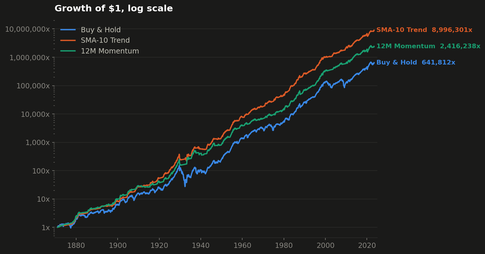
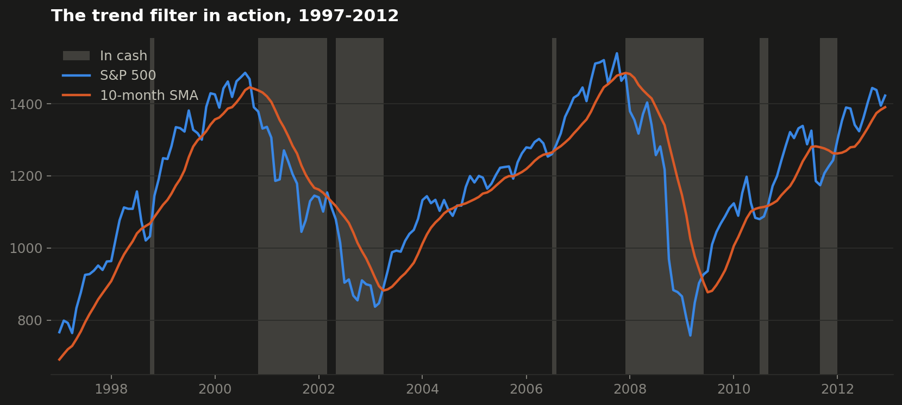
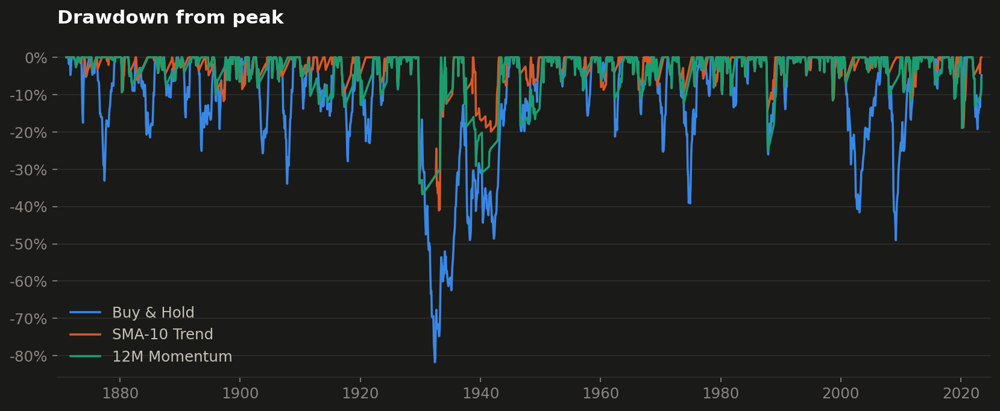

# S&P 500 Trend-Following Backtester

Does simple trend-following beat buy-and-hold? I built a small, honest
backtesting engine in Python and tested two classic rules on **155 years of
real S&P 500 monthly data** (1871–2026, Shiller dataset).



## The strategies

| Strategy | Rule |
|---|---|
| **Buy & Hold** | Always invested — the benchmark. |
| **SMA-10 Trend** | Invested while the index is above its 10-month moving average, otherwise in cash (Faber's timing model). |
| **12M Momentum** | Invested while the trailing 12-month return is positive, otherwise in cash. |

While a strategy is out of the market, the money earns the long-term interest
rate (from the same dataset) instead of sitting idle.

## Headline results — total return incl. dividends, Feb 1871 – Jun 2023

|                | Buy & Hold | SMA-10 Trend | 12M Momentum |
|:---------------|:-----------|:-------------|:-------------|
| CAGR           | 9.17%      | **11.08%**   | 10.12%       |
| Volatility     | 14.07%     | 9.41%        | 9.67%        |
| Sharpe         | 0.38       | **0.69**     | 0.58         |
| Max drawdown   | −81.8%     | **−41.0%**   | −36.7%       |
| Time in market | 100%       | 63%          | 63%          |
| Trades         | 0          | 207          | 127          |

The interesting result is not the higher return — it is the **risk**: both
trend rules roughly halve volatility and cut the worst peak-to-trough loss
from −82% (the 1930s) to about −40%, because they step aside in long bear
markets:





## Design decisions (what makes a backtest honest)

- **No look-ahead bias.** A signal computed on this month's close is only
  traded *next* month (`.shift(1)` in `strategies.py`).
- **Dividends included** in the headline run. A price-only run
  (`python run.py` without the flag) covers the full history to 2026 but
  flatters the timing strategies, because they earn interest while in cash
  while buy-and-hold's dividends are excluded — the README quotes the fair
  comparison.
- **Known limitations.** No transaction costs or taxes (207 trades in 152
  years ≈ 1.4/year, so costs are small but not zero); Shiller prices are
  monthly *averages*, which smooths the series; and 150 years of US history
  is still one sample path — this is an analysis of the past, not investment
  advice.

## Project structure

```
backtester/
  data.py        load + clean the Shiller monthly dataset
  strategies.py  each strategy = price series -> 0/1 position series
  engine.py      positions -> portfolio returns, equity, drawdown
  metrics.py     CAGR, volatility, Sharpe, max drawdown, trades
  plots.py       dark-theme charts (colorblind-safe palette)
run.py           runs every strategy, prints + saves the results
data/            sp500_monthly.csv (public-domain Shiller data)
outputs/         generated charts + results tables
```

## Run it

```bash
pip install -r requirements.txt
python run.py --total-return   # headline study
python run.py                  # price-only, full history to 2026
```

## Data

Monthly S&P 500 composite from the
[Core Datasets `s-and-p-500`](https://github.com/datasets/s-and-p-500)
mirror of Prof. Robert Shiller's public-domain dataset (price, dividends,
CPI, long interest rate, 1871→present).
